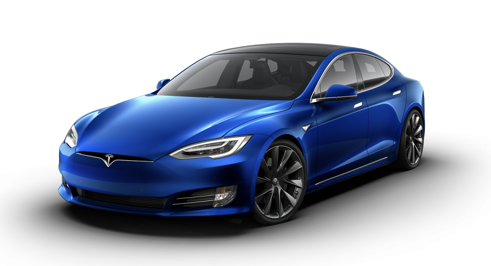
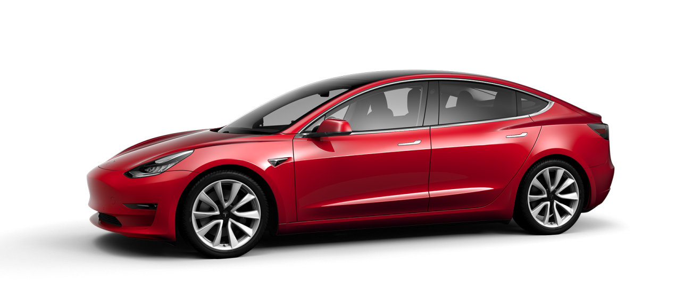

# Fund me: A Tesla

## What is this about?

I promised my colleagues that I'll share gofundme.com page to my Tesla once I get my driving license. I got the license awhile back, but was busy at work, didn't complete this page. As a New Year is dawning, I thought I could close this pending activity to close this with a satisfaction of clearing an item from my evergrowing backlog.

Also I haven't wrote in a while and [I miss my car](https://www.instagram.com/p/BVKrIlChRFJ) :-(

Though it is just for fun, but that doesn't stop me from setting up venmo & cash account :-)

## Why Tesla?

**A love at first sight**: It was end of fall 2014, I saw a blue Model S in Seattle during my first visit to USA. 

I am not a car person, but something about the car's design attracted me, felt like something and I fell in love with the car in a matter of a second. After that, for a very long time when I was planning to buy a car, I always wanted to buy a blue car, but no blue reminds me of the blue I saw in that beatiful evening during sunset.

Being a woke guy, I have several restrictions placed on myself. Though I would love to take rental and drive around, I always feel guilty if I drive alone. Even back in my country, I wait for my nephew to visit us, so I could be okay to drive somewhere I wanted without feeling I emit so much carbon just for one person, 2 person is > 1. Tesla is a clean vehicle*, (we still need to solve energy crisis, but that's a different problem) 

Trust me, I was woke even before Greta Thunberg, but she gave us a picture of a future's kid that we need to worry about. I sincerly worry that she shouldn't be the one fighting this fight. She should be happy and doing any kid of her age would do. But no politics, you know what you need to do.

## Which Tesla?

I have always struggle internally with decision paralysis whenever I need to take any big decisions, I tend to overthink, but not this time. Never in any of my decision I am clear as this one.

A Red, Model 3, Extended range, Dual motor

## Why not Blue Model S, the one you fell in love with?

I am being reasonable here. I can’t ask more, but that would be what they call the stretch goal.

Also like [Neo](https://youtu.be/YgJ5ZEn67tk?t=36) in system, these days whenever a Red Mazda (they have the best red btw) crosses me, I admire the beauty of the color, and the same reason why [my car](https://www.instagram.com/p/BVKrIlChRFJ) is also red.

## Why can’t you buy your own?

Hear me out. there is a multifold reason.

1. My employer doesn't pay me well! 
1. I don't want to badmouth USCIS here, but giving visa only for few months* and blanket RFE for H1 applications a pain, doesn't help in anyway.

with all the uncertainty (ignoring my personal reasons) I am hesitant to get one on my own.
 
On a side note, if you are one like [Jack Donaghy](https://www.youtube.com/watch?v=abiXFzuhRxQ) and willing to negotiate for me with my next employer, I'll give you a $1000 and I am serious. I am bad at negotiation; I am a good resource, I work more than whatever they pay (if I may blow one's own trumpet here), also I don't want to talk to HR/pay negotiator.

## What if you reach your goal?

I walk to Tesla and ask one to deliver ASAP 👍

## What are your willing to pay?

Insurance, DMV fee, extra for vanity plate and Gasoline :-)

## What would be your vanity plate?

**Darlene** - the bad ass sister of Elliot Alderson from [Mr.Robot](https://www.imdb.com/title/tt4158110/). If one is not available, or some variation of that or I'll settle for **Juliana** from [The Man in the High Castle](https://www.imdb.com/title/tt1740299/) 

## What would you do this Tesla when it is time to leave USA?

Like [Andy](https://www.youtube.com/watch?v=Vwu385K3Oq0) in Toy Story 3, handover his toys to the give to the kid, I will handover it for free. 

The lucky person from the future, write me when the time is ready, that you'll love this beauty and you take of this as my as I much I would.

## How can you help me if you can

[Venmo](https://venmo.com/palaniraja) | [Cash](https://cash.app/$palaniraja)

--

Wish you all, A Happy New Year 2020. Go and change the world for Good.
